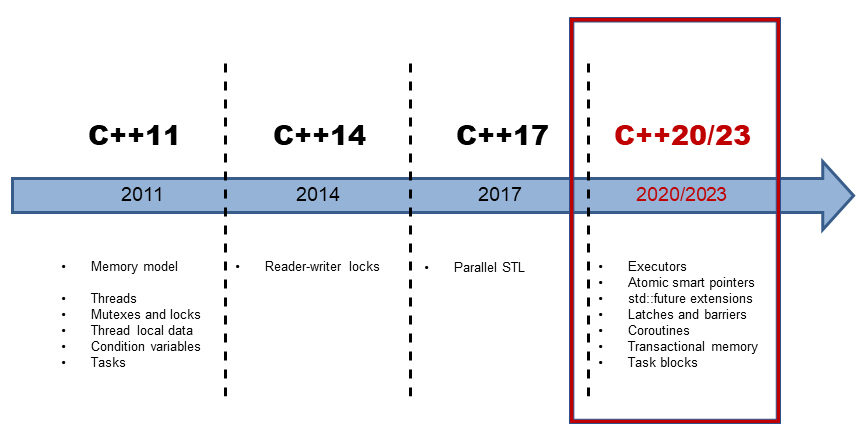
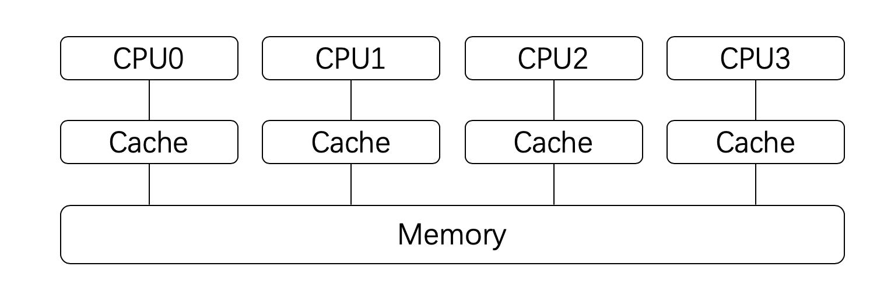
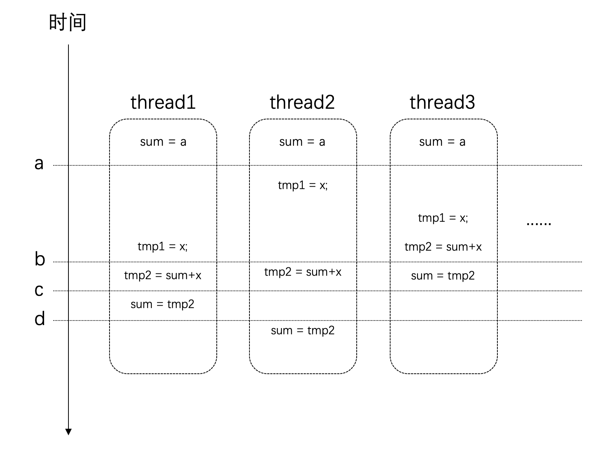

## **C++ 并发编程**

>   文章内容来自：
>
>   -   [C++ 并发编程（从C++11到C++17）](https://paul.pub/cpp-concurrency/)

C11标准以来，C++语言开始支持多线程模型，借助多线程模型，我们可以开发出更好的并发系统；

本文讲解如何使用C++进行并发编程，并尽可能涉及C++11，C++14以及C++17中的主要内容；

>   并非所有的语言都提供了多线程的环境，即便是C++语言，直到[C++11](https://en.wikipedia.org/wiki/C%2B%2B11)标准之前，也是没有多线程支持的；
>
>   在这种情况下，Linux/Unix平台下的开发者通常会使用[POSIX Threads](https://en.wikipedia.org/wiki/POSIX_Threads)，Windows上的开发者也会有[相应的接口](https://docs.microsoft.com/en-us/cpp/parallel/multithreading-with-cpp-and-mfc?view=vs-2019)；
>
>   但很明显，这些API都只针对特定的操作系统平台，可移植性较差；
>
>   如果要同时支持Linux和Windows系统，你可能要写两套代码！
>
>   **这个问题在C++ 11标准发布之后得到了改变！**
>
>   并且，在C++ 14和C++ 17标准中又对并发编程机制进行了增强；

下图是最近几个版本的C++标准特性的线路图：



### **前言：编译器与C++标准**

编译器对于语言特性的支持是逐步完成的，想要使用特定的特性你需要相应版本的编译器：

-   GCC对于C++特性的支持请参见这里：[C++ Standards Support in GCC](https://www.gnu.org/software/gcc/projects/cxx-status.html)；
-   Clang对于C++特性的支持请参见这里：[C++ Support in Clang](https://clang.llvm.org/cxx_status.html)；

下面两个表格列出了C++标准和相应编译器的版本对照：

-   C++标准与相应的GCC版本要求如下：

| C++版本 | GCC版本 |
| :------ | :------ |
| C++11   | 4.8     |
| C++14   | 5.0     |
| C++17   | 7.0     |

-   C++标准与相应的Clang版本要求如下：

| C++版本 | Clang版本 |
| :------ | :-------- |
| C++11   | 3.3       |
| C++14   | 3.4       |
| C++17   | 5.0       |

默认情况下，编译器是以较低的标准来进行编译的，如果希望使用新的标准，你可能需要通过编译参数`-std=c++xx`告知编译器，例如：

```bash
g++ -std=c++17 your_file.cpp -o your_program
```

>本文中的源码均使用[cmake](https://cmake.org/)编译，但只有cmake 3.8以上的版本才支持C++ 17，所以你需要安装这个或者更新版本的cmake；
>
>另外，截止至2019年10月，`clang`编译器还不支持[并行算法](#并行算法)；
>
>但是[gcc-9](https://gcc.gnu.org/gcc-9/changes.html)是支持的，因此想要编译和运行这部分代码，你需要安装gcc 9.0或更新的版本；
>
>并且，gcc-9还要依赖[Intel Threading Building Blocks](https://github.com/intel/tbb)才能使用并行算法以及`<execution>`头文件；

>   具体编译器对于C++特性支持的情况请参见这里：[C++ compiler support](https://en.cppreference.com/w/cpp/compiler_support)

<br/>

### **创建线程**

创建线程非常的简单的，下面就是一个使用了多线程的Hello World示例：

1_hello_thread.cpp

```cpp
#include <iostream>
#include <thread>

void hello_with_id(const int threadId) {
    std::cout << "Hello World from thread-" << threadId << std::endl;
}

void hello() {
    std::cout << "Hello World from new thread." << std::endl;
}

int main() {
    std::cout << "main start" << std::endl;

    std::thread t(hello);
    std::thread t1([] { hello_with_id(1); });
    std::thread t2([] { hello_with_id(2); });
    std::thread t3(hello_with_id, 3);

    t.join();
    t1.join();
    t2.join();
    t3.join();

    std::cout << "main end" << std::endl;
    return 0;
}
```

对于这段代码说明如下：

1.  **为了使用多线程的接口，我们需要`#include <thread>`头文件；**
2.  **新建线程的入口是一个普通的函数，它并没有什么特别的地方；**
3.  创建线程的方式就是构造一个`thread`对象，并指定入口函数；**与普通对象不一样的是，此时编译器便会为我们创建一个新的操作系统线程，并在新的线程中执行我们的入口函数；**

`thread`可以和`callable`类型一起工作，因此如果你熟悉[lambda表达式](https://en.cppreference.com/w/cpp/language/lambda)，你也可以直接用Lambda来写线程的逻辑，如下：

```cpp
std::thread t1([] { hello_with_id(1); });
std::thread t2([] { hello_with_id(2); });
```

当然，你也可以传递参数给入口函数，像下面这样：

```cpp
std::thread t3(hello_with_id, 3);
```

>   **需要注意的是：参数是以拷贝的形式进行传递的；**
>
>   因此，**对于拷贝耗时的对象，可能需要传递指针或者引用类型作为参数；**
>
>   <red>**并且，如果是传递指针或者引用，你还需要考虑参数对象的生命周期，因为线程的运行长度很可能会超过参数的生命周期（见下文`detach`），这个时候如果线程还在访问一个已经被销毁的对象就会出现问题！**</font>

<br/>

### **join与detach**

下面是两个方法说明：

| **API** | **说明**           |
| :------ | :----------------- |
| join    | 等待线程完成其执行 |
| detach  | 允许线程独立执行   |

-   `join`：调用此方法后，**当前调用线程**会一直阻塞，直到目标线程执行完成（当然，很可能目标线程在此处调用之前就已经执行完成了，不过这不要紧）；因此，如果目标线程的任务非常耗时，就要考虑好是否需要在主线程上等待它了，因此这很可能会导致主线程阻塞；
-   `detach`：`detach`是让目标线程成为守护线程（daemon threads）；一旦调用`detach`之后，目标线程将独立执行，**即便其对应的`thread`对象销毁也不影响线程的执行！并且，你无法再与之通信；**

对于这两个接口，都**必须是可执行的线程**才有意义，你可以通过`joinable()`方法查询是否可以对它们进行`join`或者`detach`；

一旦启动线程之后，我们**必须决定**是要等待直接它结束（通过`join`），还是让它独立运行（通过`detach`），**并且必须二者选其一；**

>   如果在**`thread`对象销毁的时候**我们还没有做决定，则`thread`对象在调用析构函数时将调用`std::terminate()`从而导致我们的进程异常退出！
>
>   此外需要注意的是：在我们做决定的时候，很可能线程已经执行完了（例如上面的示例中线程的逻辑仅仅是一句打印，执行时间会很短）！
>
>   新的线程创建之后，究竟是新的线程先执行，还是当前线程的下一条语句先执行这是不确定的，因为这是由操作系统的调度策略决定的；
>
>   **不过这不要紧，我们只要在`thread`对象销毁前做决定即可；**

<br/>

### **管理当前线程**

主要API：

| **API**     | **C++标准** | **说明**                                   |
| :---------- | :---------- | :----------------------------------------- |
| yield       | C++11       | 让出处理器，重新调度各执行线程；           |
| get_id      | C++11       | 返回当前线程的线程 id；                    |
| sleep_for   | C++11       | 使**当前线程**的执行停止指定的时间段；     |
| sleep_until | C++11       | 使**当前线程**的执行停止直到指定的时间点； |

上面是一些在子线程内部使用的API，它们用来对当前线程做一些控制；

-   `yield` 通常用在自己的主要任务已经完成的时候，此时希望让出处理器给其他任务使用；
-   `get_id` 返回当前线程的id，可以以此来标识不同的线程；
-   `sleep_for` 是让当前线程停止一段时间；
-   `sleep_until` 和`sleep_for`类似，但是是以具体的时间点为参数；

>   sleep_for和sleep_until这两个API都依赖于 [chrono](https://en.cppreference.com/w/cpp/header/chrono) API（由于篇幅所限，这里不展开这方面内容）；

下面是一个代码示例：

2_thread_self_manage.cpp

```cpp
#include <iostream>
#include <thread>
#include <chrono>
#include <iomanip>
#include <sstream>
#include <ctime>

using namespace std;

void print_time() {
    // 获取当前系统当前时间time_point
    auto now = chrono::system_clock::now();
    // 将time_point转换成time_t秒
    auto in_time_t = chrono::system_clock::to_time_t(now);

    std::stringstream ss;
    ss << put_time(localtime(&in_time_t), "%Y-%m-%d %X");
    cout << "now is: " << ss.str() << endl;
}

void sleep_thread() {
    this_thread::sleep_for(chrono::seconds(3));
    cout << "[thread-" << this_thread::get_id() << "] is waking up" << endl;
}

void loop_thread() {
    for (int i = 0; i < 10; i++) {
        cout << "[thread-" << this_thread::get_id() << "] print: " << i << endl;
    }
}

int main() {
    print_time();

    thread t1(sleep_thread);
    thread t2(loop_thread);

    t1.join();
    t2.detach();

    print_time();
    return 0;
}
```

这段代码应该还是比较容易理解的：这里创建了两个线程，它们都会有一些输出，其中一个会先停止3秒钟，然后再输出；主线程调用`join`会一直卡住等待它运行结束；

这段程序的输出如下：

```
now is: 2020-12-27 20:01:12
[thread-0x8000512c0] print: 0
[thread-0x8000512c0] print: 1
[thread-0x8000512c0] print: 2
[thread-0x8000512c0] print: 3
[thread-0x8000512c0] print: 4
[thread-0x8000512c0] print: 5
[thread-0x8000512c0] print: 6
[thread-0x8000512c0] print: 7
[thread-0x8000512c0] print: 8
[thread-0x8000512c0] print: 9
[thread-0x8000511c0] is waking up
now is: 2020-12-27 20:01:15
```

<br/>

### **单次调用**

主要API：

| **API**   | **C++标准** | **说明**                                           |
| :-------- | :---------- | :------------------------------------------------- |
| call_once | C++11       | 即便**在多线程环境下，也能保证只调用某个函数一次** |
| once_flag | C++11       | **与`call_once`配合使用**                          |

在一些情况下，我们有些任务需要执行一次，并且我们**只希望它执行一次**，例如资源的初始化任务；

这个时候就可以用到上面的API，这个API会保证，即便在多线程的环境下，相应的函数也只会调用一次！

下面就是一个示例：有三个线程都会使用`init`函数，但是只会有一个线程真正执行它；

3_call_once.cpp

```cpp
#include <iostream>
#include <mutex>
#include <thread>

void init() {
    std::cout << "Initialing..." << std::endl;
    // Do something...
}

void worker(std::once_flag* flag) {
    std::call_once(*flag, init);
}

int main() {
    std::once_flag flag;

    std::thread t1(worker, &flag);
    std::thread t2(worker, &flag);
    std::thread t3(worker, &flag);

    t1.join();
    t2.join();
    t3.join();

    return 0;
}
```

输出如下：

```
Initialing...
```

我们无法确定具体是哪一个线程会执行`init`，而事实上，我们也不关心，因为只要有某个线程完成这个初始化工作就可以了！

>   思考一下，为什么要在main函数中创建`once_flag flag`，如果是在`worker`函数中直接声明一个`once_flag`并使用行不行？
>
>   **显然是不行的：在main中创建的一个flag被同时传给了三个线程，相当于一个独占锁，抢到锁的线程会去执行这个单次函数；如果在worker中创建，则每个线程中都是各自隔离的flag变量，无法起到锁的作用！**

<br/>

### **并发任务**

下面以一个并发任务为示例讲解如何引入多线程；

任务示例：我们需要计算某个范围内所有自然数的平方根之和，例如`[1, 10e7]`；

在单线程模型下，我们的代码可能是这样的：

4_naive_multithread.cpp

```cpp
static const int MAX = 10e7;
static double sum = 0;

void worker(int min, int max) {
    for (int i = min; i <= max; ++i) {
        sum += std::sqrt(i);
    }
}

void serial_task(int min, int max) {
    auto start_time = chrono::steady_clock::now();
    sum = 0;
    worker(min, max);
    auto end_time = chrono::steady_clock::now();
    auto ms = chrono::duration_cast<chrono::milliseconds>(end_time - start_time).count();
    cout << "Serial task finish, " << ms << " ms consumed, Result: " << sum << endl;
}

int main() {
    serial_task(0, MAX);
    return 0;
}
```

输出如下：

```
Serial task finish, 15543 ms consumed, Result: 6.66667e+11
```

很显然，上面单线程的做法性能太差了；由于我们的任务完全是可以并发执行的(各个计算子任务之间无关)，并且任务很容易划分；

下面我们就尝试以多线程的方式来改造原先的程序，改造后的程序如下：

4_naive_multithread.cpp

```cpp
void concurrent_task(int min, int max) {
    auto start_time = chrono::steady_clock::now();

    // 硬件支持的并发线程数(推荐值)
    unsigned concurrent_count = thread::hardware_concurrency();
    cout << "hardware_concurrency: " << concurrent_count << endl;
    vector<thread> threads;

    // 重置sum
    sum = 0;
    for (int t = 0; t < concurrent_count; t++) {
        int range = max / (int)concurrent_count * (t + 1);
        threads.emplace_back(worker, min, range);
        min = range + 1;
    }

    for (auto& t : threads) {
        t.join();
    }

    auto end_time = chrono::steady_clock::now();
    auto ms = chrono::duration_cast<chrono::milliseconds>(end_time - start_time).count();
    cout << "Concurrent task finish, " << ms << " ms consumed, Result: " << sum << endl;
}
```

这段代码说明如下：

1.  `thread::hardware_concurrency()`可以获取到当前硬件支持多少个线程并行执行；
2.  根据处理器的情况决定线程的数量；
3.  对于每一个线程都通过`worker`函数来完成任务，并划分一部分数据给它处理；
4.  等待每一个线程执行结束；

最后我们运行一下这个程序，输出结果：

```
Serial task finish, 15427 ms consumed, Result: 6.66667e+11
hardware_concurrency: 16
Concurrent task finish, 2774 ms consumed, Result: 6.04944e+11
```

**我们会发现这里的结果是错误的！**

这是由于现代的处理器为了加速处理的速度，每个处理器都会有自己的高速缓存（Cache），这个高速缓存是与每个处理器相对应的，如下图所示：



>   **事实上，目前大部分CPU的缓存已经不只一层**

处理器在进行计算的时候，高速缓存会参与其中，例如：数据的读和写；

而高速缓存和系统主存（Memory）是有可能存在不一致的，即：**某个结果计算后保存在处理器的高速缓存中了，但是没有同步到主存中，此时这个值对于其他处理器就是不可见的；**

事情还远不止这么简单，我们对于全局变量值的修改：`sum += sqrt(i);`这条语句，它并非是原子的，而是很多条汇编指令的组合才能完成；

假设在某个设备上，这条语句通过下面这几个步骤来完成。它们的时序可能如下所示：



在时间点a的时候，所有线程对于`sum`变量的值是一致的；

但是在时间点b之后，thread3上已经对`sum`进行了赋值，但这个时候其他几个线程也同时在其他处理器上使用了这个值，那么这个时候它们所使用的值就是旧的（错误的），最后得到的结果也自然是错的；

<br/>

### **互斥体与锁**

当多个进程或者线程同时访问共享数据时，只要有一个任务会修改数据，那么就可能会发生问题，此时结果依赖于这些任务执行的相对时间，这种场景称为[**竞争条件**（race condition）](https://en.wikipedia.org/wiki/Race_condition)；

访问共享数据的代码片段称之为**临界区**（critical section），具体到上面这个示例，临界区就是读写`sum`变量的地方；

要避免竞争条件，就需要对临界区进行数据保护：如果一次只让一个线程访问共享数据，访问完了再让其他线程接着访问，这样就可以避免问题的发生了；

接下来介绍的API提供的就是这样的功能；

#### **mutex**

开发并发系统的目的主要是为了提升性能：将任务分散到多个线程，然后在不同的处理器上同时执行；

这些分散开来的线程通常会包含两类任务：

1.  独立的对于划分给自己的数据的处理；
2.  对于处理结果的汇总；

其中第1项任务因为每个线程是独立的，不存在竞争条件的问题，而第2项任务，由于所有线程都可能往总结果（例如上面的`sum`变量）汇总，这就需要做保护了；

在某一个具体的时刻，只应当有一个线程更新总结果，即：保证每个线程对于共享数据的访问是“互斥”的，`mutex` 就提供了这样的功能；

`mutex`是**mut**ual **ex**clusion（互斥）的简写；

主要API：

| **API**               | **C++标准** | **说明**                                                     |
| :-------------------- | :---------- | :----------------------------------------------------------- |
| mutex                 | C++11       | 提供基本互斥设施                                             |
| timed_mutex           | C++11       | 提供互斥设施，带有超时功能                                   |
| recursive_mutex       | C++11       | 提供能被**同一线程递归锁定(可重入)**的互斥设施               |
| recursive_timed_mutex | C++11       | 提供能被**同一线程递归锁定(可重入)**的互斥设施，带有超时功能 |
| shared_timed_mutex    | C++14       | 提供共享互斥设施并带有超时功能                               |
| shared_mutex          | C++17       | 提供共享互斥设施                                             |

很明显，在这些类中，`mutex`是最基础的API，其他类都是在它的基础上的改进；

这些类都提供了下面三个方法，并且它们的功能是一样的：

| **方法** | **说明**                             |
| -------- | ------------------------------------ |
| lock     | 锁定互斥体，如果未获得锁，则阻塞     |
| try_lock | 尝试锁定互斥体，如果不可用，直接返回 |
| unlock   | 解锁互斥体                           |

这三个方法提供了基础的锁定和解除锁定的功能；使用`lock`意味着你有很强的意愿一定要获取到互斥体，而使用`try_lock`则是进行一次尝试，这意味着如果失败了，你通常还有其他的路径可以走；

在这些基础功能之上，其他的类分别在下面三个方面进行了扩展：

-   **超时**：`timed_mutex`，`recursive_timed_mutex`，`shared_timed_mutex`的名称都带有`timed`，这意味着它们都支持超时功能。它们都提供了`try_lock_for`和`try_lock_until`方法，这两个方法分别可以指定超时的时间长度和时间点。如果在超时的时间范围内没有能获取到锁，则直接返回，不再继续等待；
-   **可重入**：`recursive_mutex`和`recursive_timed_mutex`的名称都带有`recursive`。可重入或者叫做可递归，是指在同一个线程中，同一把锁可以锁定多次，这就避免了一些不必要的死锁；
-   **共享**：`shared_timed_mutex`和`shared_mutex`提供了共享功能。对于这类互斥体，实际上是提供了两把锁：一把是共享锁，一把是互斥锁。一旦某个线程获取了互斥锁，任何其他线程都无法再获取互斥锁和共享锁；但是如果有某个线程获取到了共享锁，其他线程无法再获取到互斥锁，但是还有获取到共享锁。这里互斥锁的使用和其他的互斥体接口和功能一样。而共享锁可以同时被多个线程同时获取到（使用共享锁的接口见下面的表格）。共享锁通常用在[读写模型](https://en.wikipedia.org/wiki/Readers–writers_problem)中；

使用共享锁的接口如下：

| **方法**        | **说明**                               |
| --------------- | -------------------------------------- |
| lock_shared     | 获取互斥体的共享锁，如果无法获取则阻塞 |
| try_lock_shared | 尝试获取共享锁，如果不可用，直接返回   |
| unlock_shared   | 解锁共享锁                             |

接下来，我们就借助`mutex`来改造我们的并发系统，改造后的程序如下：

5_mutex_lock.cpp

```cpp
#include <iostream>
#include <chrono>
#include <cmath>
#include <thread>
#include <vector>
#include <mutex>

using namespace std;

static const int MAX = 10e7;
static double sum = 0;

// lock
static mutex exclusive;

void concurrent_worker(int min, int max) {
    for (int i = min; i <= max; ++i) {
        exclusive.lock();
        sum += sqrt(i);
        exclusive.unlock();
    }
}

void concurrent_task(int min, int max) {
    auto start_time = chrono::steady_clock::now();

    // 硬件支持的并发线程数(推荐值)
    unsigned concurrent_count = thread::hardware_concurrency();
    cout << "hardware_concurrency: " << concurrent_count << endl;
    vector<thread> threads;

    // 重置sum
    sum = 0;
    for (int t = 0; t < concurrent_count; t++) {
        int range = max / (int)concurrent_count * (t + 1);
        threads.emplace_back(concurrent_worker, min, range);
        min = range + 1;
    }

    for (auto& t : threads) {
        t.join();
    }

    auto end_time = chrono::steady_clock::now();
    auto ms = chrono::duration_cast<chrono::milliseconds>(end_time - start_time).count();
    cout << "Concurrent task finish, " << ms << " ms consumed, Result: " << sum << endl;
}

int main() {
    concurrent_task(0, MAX);
    return 0;
}
```

执行之后结果输出如下：

```
hardware_concurrency: 16
Concurrent task finish, 283176 ms consumed, Result: 6.66667e+11
```

这下结果是对了，但是我们却发现**这个版本比原先单线程的版本性能还要差很多！**这是为什么？

这是因为加锁和解锁是有代价的，这里计算最耗时的地方在锁里面，每次只能有一个线程串行执行，相比于单线程模型，它不但是串行的，还增加了锁的负担，因此就更慢了！

这就是为什么前面说多线程系统会增加系统的复杂度，而且**并非多线程系统一定就有更好的性能**；

不过，对于这里的问题是可以改进的；我们仔细思考一下：我们划分给每个线程的数据其实是独立的，对于数据的处理是耗时的，但其实这部分逻辑每个线程可以单独处理，没必要加锁；只有在最后汇总数据的时候进行一次锁保护就可以了；

于是我们改造`concurrent_worker`，像下面这样：

6_improved_mutex_lock.cpp

```cpp
void concurrent_worker(int min, int max) {
    double tmp_sum = 0;
    for (int i = min; i <= max; i++) {
        tmp_sum += sqrt(i);
    }
    exclusive.lock();
    sum += tmp_sum;
    exclusive.unlock();
}
```

运行一下改进后的程序，其结果输出如下：

```
hardware_concurrency: 16
Concurrent task finish, 1609 ms consumed, Result: 6.66667e+11
```

可以看到，性能一下就提升了好多倍！我们终于体验到多线程带来的好处了！

我们用锁的**粒度**（granularity）来描述锁的范围：**细粒度**（fine-grained）是指锁保护较小的范围，**粗粒度**（coarse-grained）是指锁保护较大的范围；

出于性能的考虑，我们应该保证锁的粒度尽可能的细；并且，不应该在获取锁的范围内执行耗时的操作，例如执行IO。如果是耗时的运算，也应该尽可能的移到锁的外面；

<br/>

#### **死锁**

死锁是并发系统很常见的一类问题；

**死锁是指：两个或以上的运算单元，每一方都在等待其他方释放资源，但是所有方都不愿意释放资源；结果是没有任何一方能继续推进下去，于是整个系统无法再继续运转；**

下面我们来看一个编程示例：现在假设我们在开发一个银行的系统，这个系统包含了转账的功能；

首先我们创建一个`Account`类来描述银行账号。由于这仅仅是一个演示使用的代码，所以我们希望代码足够的简单。`Account`类仅仅包含名称和金额两个字段；

另外，为了支持并发，这个类包含了一个`mutex`对象，用来保护账号金额，在读写账号金额时需要先加锁保护；

7_deadlock_bank_transfer.cpp

```cpp
class Account {
public:
    Account(string mName, double mMoney) : mName(std::move(mName)), mMoney(mMoney) {};

public:
    void changeMoney(double amount) {
        mMoney += amount;
    }

    string getName() {
        return mName;
    }

    double getMoney() const {
        return mMoney;
    }

    mutex *getLock() {
        return &moneyLock;
    }

private:
    string mName;
    double mMoney;
    mutex moneyLock;
};
```

接下来，我们再创建一个描述银行的`Bank`类：

7_deadlock_bank_transfer.cpp

```cpp
class Bank {
public:
    void addAccount(Account *account) {
        mAccounts.insert(account);
    }

    static bool transferMoney(Account *accountA, Account *accountB, double amount) {
        lock_guard guardA(*accountA->getLock());
        lock_guard guardB(*accountB->getLock());

        if (amount > accountA->getMoney()) {
            return false;
        }

        accountA->changeMoney(-amount);
        accountB->changeMoney(amount);
        return true;
    }

    [[nodiscard]] double totalMoney() const {
        double sum = 0;
        for (auto a : mAccounts) {
            sum += a->getMoney();
        }
        return sum;
    }

private:
    set<Account *> mAccounts;
};
```

银行类中记录了所有的账号，并且提供了一个方法用来查询整个银行的总金额。

这其中，我们最主要要关注转账的实现：`transferMoney`。该方法的几个关键点如下：

1.  为了保证线程安全，在修改每个账号之前，需要获取相应的锁；
2.  判断转出账户金额是否足够，如果不够此次转账失败；
3.  进行转账；

有了银行和账户结构之后就可以开发转账系统了，同样的，由于是为了演示所用，我们的转账系统也会尽可能的简单：

7_deadlock_bank_transfer.cpp

```cpp
[[noreturn]] void randomTransfer(Bank *bank, Account *accountA, Account *accountB) {
    while (true) {
        double randomMoney = (double) rand() / RAND_MAX * 100;
        if (Bank::transferMoney(accountA, accountB, randomMoney)) {
            cout << "Transfer " << randomMoney << " from " << accountA->getName()
                 << " to " << accountB->getName()
                 << ", Bank totalMoney: " << bank->totalMoney() << endl;
        } else {
            cout << "Transfer failed, "
                 << accountA->getName() << " has only $" << accountA->getMoney() << ", but "
                 << randomMoney << " required" << endl;
        }
    }
}
```

这里每次生成一个随机数，然后通过银行进行转账。

最后我们在`main`函数中创建两个线程，互相在两个账号之间来回转账：

7_deadlock_bank_transfer.cpp

```cpp
int main() {
    Account a("Paul", 100);
    Account b("Moira", 100);

    Bank aBank;
    aBank.addAccount(&a);
    aBank.addAccount(&b);

    thread t1(randomTransfer, &aBank, &a, &b);
    thread t2(randomTransfer, &aBank, &b, &a);

    t1.join();
    t2.join();

    return 0;
}
```

至此，我们的银行转账系统就开发完成了。然后编译并运行，其结果可能像下面这样：

```
...
Transfer 13.2901 from Paul to Moira, Bank totalMoney: 20042.6259 from Moira to Paul, Bank totalMoney: 200
Transfer failed, Moira has only $34.7581, but 66.3208 required
Transfer failed, Moira has only $34.7581, but 
Transfer 93.191 from 53.9176 required
Transfer 60.6146 from Moira to Paul, Bank totalMoney: 200
Transfer 49.7304 from Moira to Paul, Bank totalMoney: 200Paul to Moira, Bank totalMoney: 
Transfer failed, Moira has only $17.6041, but 18.1186 required
Transfer failed, Moira has only $17.6041, but 18.893 required
Transfer failed, Moira has only $17.6041, but 34.7078 required
Transfer failed, Moira has only $17.6041, but 33.9569 required
Transfer 12.7899 from 200
Moira to Paul, Bank totalMoney: 200
Transfer failed, Moira has only $63.9373, but 80.9038 required
Transfer 50.933 from Moira to Paul, Bank totalMoney: 200
Transfer failed, Moira has only $13.0043, but 30.2056 required
Transfer failed, Moira has only $Transfer 59.123 from Paul to Moira, Bank totalMoney: 200
Transfer 29.0486 from Paul to Moira, Bank totalMoney: 20013.0043, but 64.7307 required
```

如果你运行了这个程序，你会发现很快它就卡住不动了：因为发生了死锁！

我们仔细思考一下这两个线程的逻辑：这两个线程可能会同时获取其中一个账号的锁，然后又想获取另外一个账号的锁，此时就发生了死锁；

>   当然，发生死锁的原因远不止上面这一种情况。如果两个线程互相`join`就可能发生死锁；
>
>   还有在一个线程中对一个不可重入的互斥体（例如`mutex`而非`recursive_mutex`）多次加锁也会死锁；

如果仔细看一下上面的输出，我们会发现还有另外一个问题：这里的输出是乱的，两个线程的输出混杂在一起了；究其原因也很容易理解：两个线程可能会同时输出，没有做好隔离；

下面我们就来逐步解决上面的问题；

对于输出混乱的问题很好解决，专门用一把锁来保护输出逻辑即可：

8_improved_bank_transfer.cpp

```cpp
// cout lock
mutex sCoutLock;
[[noreturn]] void randomTransfer(Bank *bank, Account *accountA, Account *accountB) {
    while (true) {
        double randomMoney = (double) rand() / RAND_MAX * 100;
        if (Bank::transferMoney(accountA, accountB, randomMoney)) {
            sCoutLock.lock();
            cout << "Transfer " << randomMoney << " from " << accountA->getName()
                 << " to " << accountB->getName()
                 << ", Bank totalMoney: " << bank->totalMoney() << endl;
            sCoutLock.unlock();
        } else {
            sCoutLock.lock();
            cout << "Transfer failed, "
                 << accountA->getName() << " has only $" << accountA->getMoney() << ", but "
                 << randomMoney << " required" << endl;
            sCoutLock.unlock();
        }
    }
}
```

<br/>

#### **通用锁定算法**

主要API：

| **API**  | **C++标准** | **说明**                                     |
| :------- | :---------- | :------------------------------------------- |
| lock     | C++11       | 锁定指定的互斥体，若任何一个不可用则阻塞     |
| try_lock | C++11       | 试图通过重复调用 try_lock 获得互斥体的所有权 |

有一个比较简单的原则可以避免死锁，即：对所有的锁进行排序，每次一定要按照顺序来获取锁，不允许乱序；

例如：要获取某个玩具，一定要先拿到锁A，再拿到锁B，才能玩玩具。这样就不会死锁了；

这个原则虽然简单，但却不容易遵守。因为数据常常是分散在很多地方的；

不过好消息是，C++ 11标准中为我们提供了一些工具来避免因为多把锁而导致的死锁。我们只要直接调用这些API就可以了：就是上面提到的两个函数；

**它们都支持传入多个[Lockable](https://en.cppreference.com/w/cpp/named_req/Lockable)对象；**

接下来我们用它来改造之前死锁的转账系统：

8_improved_bank_transfer.cpp

```cpp
static bool transferMoney(Account *accountA, Account *accountB, double amount) {
    lock(*accountA->getLock(), *accountB->getLock());    // ①
    lock_guard lockA(*accountA->getLock(), adopt_lock);  // ②
    lock_guard lockB(*accountB->getLock(), adopt_lock);  // ③

    // lock_guard guardA(*accountA->getLock());
    // lock_guard guardB(*accountB->getLock());

    if (amount > accountA->getMoney()) {
        return false;
    }

    accountA->changeMoney(-amount);
    accountB->changeMoney(amount);
    return true;
}
```

这里只改动了3行代码：

1.  这里**通过`lock`函数来获取两把锁，标准库的实现会保证不会发生死锁；**
2.  `lock_guard`在下面我们还会详细介绍，这里只要知道**lock_guard会在自身对象生命周期的范围内锁定互斥体**即可；**创建`lock_guard`的目的是为了在`transferMoney`结束的时候释放锁，`lockB`也是一样；**但需要注意的是：这里传递了`adopt_lock`表示：现在是已经获取到互斥体了的状态了，不用再次加锁（如果不加`adopt_lock`就是二次锁定了）；

现在这个转账程序会一直运行下去，不会再死锁了。输出也是正常的了；

<br/>

#### **通用互斥管理**

互斥体（`mutex`相关类）提供了对于资源的保护功能，但是手动的锁定（调用`lock`或者`try_lock`）和解锁（调用`unlock`）互斥体是要耗费比较大的精力的，我们需要精心考虑和设计代码才行：因为我们需要保证，在任何情况下，解锁要和加锁配对；假设出现一条路径导致获取锁之后没有正常释放，就会影响整个系统！如果考虑方法还可以会抛出异常，这样的代码写起来会更费劲！

鉴于这个原因，标准库就提供了下面的这些API，它们都使用了RAII的编程技巧，来简化我们手动加锁和解锁的“体力活”；

主要API：

| **API**     | **C++标准** | **说明**                                   |
| :---------- | :---------- | :----------------------------------------- |
| lock_guard  | C++11       | 实现**严格基于作用域的互斥体所有权**包装器 |
| unique_lock | C++11       | 实现**可移动的互斥体所有权**包装器         |
| shared_lock | C++14       | 实现**可移动的共享互斥体所有权**封装器     |
| scoped_lock | C++17       | 用于**多个互斥体的免死锁 RAII**封装器      |

| **锁定策略** | **C++标准** | **说明**                                                |
| :----------- | :---------- | :------------------------------------------------------ |
| defer_lock   | C++11       | 类型为 `defer_lock_t`，**不获得互斥的所有权**           |
| try_to_lock  | C++11       | 类型为`try_to_lock_t`，**尝试获得互斥的所有权**而不阻塞 |
| adopt_lock   | C++11       | 类型为`adopt_lock_t`，**假设调用方已拥有互斥的所有权**  |

请看下面的例子：

9_lock_guard

```cpp
#include <thread>
#include <mutex>
#include <iostream>

int inc_num = 0;
std::mutex inc_mutex;  // ①

void safe_increment() {
    std::lock_guard<std::mutex> lock(inc_mutex);  // ②
    ++inc_num;

    std::cout << std::this_thread::get_id() << ": " << inc_num << '\n'; // ③
}

int main() {
    std::cout << "main: " << inc_num << '\n';

    std::thread t1(safe_increment);
    std::thread t2(safe_increment);

    t1.join();
    t2.join();

    std::cout << "main: " << inc_num << '\n';
    return 0;
}
```

这段代码中：

1.  全局的互斥体`inc_mutex`用来保护全局变量`inc_num`；
2.  safe_increment是一个设计为可以被多线程环境使用的方法，因此需要通过互斥体来进行保护；注：这里没有调用`lock`方法，而是直接使用`lock_guard`来锁定互斥体；
3.  在方法结束时，局部变量`std::lock_guard<std::mutex> lock`会被销毁，它对互斥体的锁定也就解除了；

#### **RAII**

上面的几个类（`lock_guard`，`unique_lock`，`shared_lock`，`scoped_lock`）都使用了一个叫做RAII的编程技巧；

RAII全称是Resource Acquisition Is Initialization，直译过来就是：资源获取即初始化；

RAII是一种[C++编程技术](http://www.stroustrup.com/bs_faq2.html#finally)，它将必须在使用前请求的资源（例如：分配的堆内存、执行线程、打开的套接字、打开的文件、锁定的互斥体、磁盘空间、数据库连接等——任何存在受限供给中的事物）的生命周期与一个对象的生存周期相绑定。 RAII保证资源可用于任何会访问该对象的函数。它亦保证所有资源在其控制对象的生存期结束时，以获取顺序的逆序释放。类似地，若资源获取失败（构造函数以异常退出），则为已构造完成的对象和基类子对象所获取的所有资源，会以初始化顺序的逆序释放。这有效地利用了语言特性以消除内存泄漏并保证异常安全。

RAII 可总结如下:

-   **将每个资源封装入一个类，其中：**
    -   **构造函数请求资源，并建立所有类不变式，或在它无法完成时抛出异常，**
    -   **析构函数释放资源并决不抛出异常；**
-   **始终经由 RAII 类的实例使用满足要求的资源，该资源**
    -   **自身拥有自动存储期或临时生存期，或**
    -   **具有与自动或临时对象的生存期绑定的生存期**

回想一下上文中的`transferMoney`方法中的三行代码：

```cpp
lock(*accountA->getLock(), *accountB->getLock());
lock_guard lockA(*accountA->getLock(), adopt_lock);
lock_guard lockB(*accountB->getLock(), adopt_lock);
```

如果使用`unique_lock`这三行代码还有一种等价的写法：

```cpp
unique_lock lockA(*accountA->getLock(), defer_lock);
unique_lock lockB(*accountB->getLock(), defer_lock);
lock(*accountA->getLock(), *accountB->getLock());
```

注意：这里`lock`方法的调用位置。这里先定义`unique_lock`指定了`defer_lock`，因此实际没有锁定互斥体，而是到第三行才进行锁定；

最后，借助`scoped_lock`，我们可以将三行代码合成一行，这种写法也是等价的。

```cpp
scoped_lock lockAll(*accountA->getLock(), *accountB->getLock());
```

`scoped_lock`会在其生命周期范围内锁定互斥体，销毁的时候解锁。同时，它可以锁定多个互斥体，并且避免死锁。

目前，只还有`shared_lock`我们没有提到。它与其他几个类的区别在于：它是以共享的方式锁定互斥体；

>   更多关于RAII，见：
>
>   -   [浅谈C++中的RAII](https://jasonkayzk.github.io/2020/12/13/%E6%B5%85%E8%B0%88C++%E4%B8%AD%E7%9A%84RAII/)

<br/>

### **条件变量**

目前，我们还有一个地方可以改进，那就是：转账金额不足的时候，程序直接返回了`false`；

这很难说是一个好的策略。因为，即便虽然当前账号金额不足以转账，但只要别的账号又转账进来之后，当前这个转账操作也许就可以继续执行了；

这在很多业务中是很常见的一个需求：每一次操作都要正确执行，如果条件不满足就停下来等待，直到条件满足之后再继续。而不是直接返回；

条件变量提供了一个可以让多个线程间同步协作的功能。这对于[生产者-消费者模型](https://en.wikipedia.org/wiki/Producer–consumer_problem)很有意义。在这个模型下：

-   生产者和消费者共享一个工作区。这个区间的大小是有限的。
-   生产者总是产生数据放入工作区中，当工作区满了。它就停下来等消费者消费一部分数据，然后继续工作。
-   消费者总是从工作区中拿出数据使用。当工作区中的数据全部被消费空了之后，它也会停下来等待生产者往工作区中放入新的数据。

从上面可以看到，无论是生产者还是消费者，当它们工作的条件不满足时，它们并不是直接报错返回，而是停下来等待，直到条件满足；

C++中提供的与条件相关的API如下表：


| **API**                   | **C++标准** | **说明**                                     |
| :------------------------ | :---------- | :------------------------------------------- |
| condition_variable        | C++ 11      | 提供与 std::unique_lock 关联的条件变量       |
| condition_variable_any    | C++ 11      | 提供与任何锁类型关联的条件变量               |
| notify_all_at_thread_exit | C++ 11      | 安排到在此线程完全结束时对 notify_all 的调用 |
| cv_status                 | C++ 11      | 列出条件变量上定时等待的可能结果             |

下面我们就借助于条件变量，再次改造之前的银行转账系统；

这个改造主要在于账号类。我们重点是要调整`changeMoney`方法：

10_bank_transfer_wait_notify.cpp

```cpp
void changeMoney(double amount) {
    unique_lock lock(moneyLock);
    mConditionVar.wait(lock, [this, amount] {
        // 调整后金额合法
        return mMoney + amount > 0;
    });
    mMoney += amount;
    // 通知其他线程
    mConditionVar.notify_all();
}

private:
    condition_variable mConditionVar;
```

这几处改动说明如下：

1.  声明了一个条件变量mConditionVar，用来在多个线程之间协作；
2.  这里使用的是`unique_lock`，这是为了与条件变量相配合。因为条件变量会解锁和重新锁定互斥体；
3.  通过调用条件变量的wait方法进行等待。此时：会通过后面的lambda表达式判断条件是否满足。**如果满足则继续；如果不满足，则此处会解锁互斥体，并让当前线程等待。**解锁这一点非常重要，因为只有这样，才能让其他线程获取互斥体；
4.  这里是使用lambda表达式声明的条件变量等待条件；
5.  最后调用notify_all：当金额发生变动之后，我们需要通知所有在条件变量上等待的其他线程。此时所有调用`wait`线程都会再次唤醒，然后尝试获取锁（当然，只有一个能获取到）并再次判断条件是否满足。除了`notify_all`还有`notify_one`，它只通知一个等待的线程。`wait`和`notify`就构成了线程间互相协作的工具。

有了上面的改动之后，银行的转账方法实现起来就很简单了，不用再考虑数据保护的问题了：


有了上面的改动之后，银行的转账方法实现起来就很简单了，不用再考虑数据保护的问题了：

10_bank_transfer_wait_notify.cpp

```cpp
static void transferMoney(Account *accountA, Account *accountB, double amount) {
    accountA->changeMoney(-amount);
    accountB->changeMoney(amount);
}
```

当然，转账逻辑也会变得简单，不用再管转账失败的情况发生；

10_bank_transfer_wait_notify.cpp

```cpp
mutex sCoutLock;
[[noreturn]] void randomTransfer(Bank *bank, Account *accountA, Account *accountB) {
    while(true) {
        double randomMoney = (double) rand() / RAND_MAX * 100;
        {
            lock_guard guard(sCoutLock);
            cout << "Try to Transfer " << randomMoney
                 << " from " << accountA->getName() << "(" << accountA->getMoney()
                 << ") to " << accountB->getName() << "(" << accountB->getMoney()
                 << "), Bank totalMoney: " << bank->totalMoney() << endl;
        }
        Bank::transferMoney(accountA, accountB, randomMoney);
    }
}
```

<br/>

### **future**

这一小节中，我们来熟悉更多的可以在并发环境中使用的工具，它们都位于`<future>`头文件中；

| **API**       | **C++标准** | **说明**                                          |
| :------------ | :---------- | :------------------------------------------------ |
| async         | C++11       | 异步运行一个函数，并返回保有其结果的`std::future` |
| future        | C++11       | 等待被异步设置的值                                |
| packaged_task | C++11       | 打包一个函数，存储其返回值以进行异步获取          |
| promise       | C++11       | 存储一个值以进行异步获取                          |
| shared_future | C++11       | 等待被异步设置的值（可能为其他 future 所引用）    |

#### **async**

很多语言都提供了异步的机制，异步使得**耗时的操作不影响当前主线程的执行流**；

在C++11中，`async`便是完成这样的功能的。下面是一个代码示例：

11_async_task.cpp

```cpp
static const int MAX = 10e7;
static double sum = 0;

void worker(int min, int max) {
    for (int i = min; i <= max; i++) {
        sum += sqrt(i);
    }
}

int main() {
    sum = 0;
    auto f1 = async(worker, 0, MAX);
    cout << "Async task triggered" << endl;
    f1.wait();
    cout << "Async task finish, result: " << sum << endl << endl;

    return 0;
}
```

这仍然是我们之前熟悉的例子。这里有两个地方需要说明：

1.  这里以异步的方式启动了任务，它会返回一个`future`对象。`future`用来存储异步任务的执行结果，关于`future`我们在后面`packaged_task`的例子中再详细说明，在这个例子中我们仅仅用它来等待任务执行完成；
2.  最后调用wait方法等待异步任务执行完成；

>   **需要注意的是：默认情况下，`async`是启动一个新的线程，还是以同步的方式（不启动新的线程）运行任务，这一点标准是没有指定的，由具体的编译器决定！**
>
>   **如果希望一定要以新的线程来异步执行任务，可以通过`launch::async`来明确说明。`launch`中有两个常量：**
>
>   -   `async`：运行新线程，以异步执行任务；
>   -   `deferred`：调用方线程上第一次请求其结果时才执行任务，即惰性求值；

除了通过函数来指定异步任务，还可以lambda表达式的方式来指定。如下所示：

11_async_task.cpp

```cpp
int main() {
    double result = 0;
    cout << "Async task with lambda triggered, thread: " << this_thread::get_id() << endl;
    auto f2 = async(launch::async, [&result]() {
        cout << "Lambda task in thread: " << this_thread::get_id() << endl;
        for (int i = 0; i <= MAX; i++) {
            result += sqrt(i);
        }
    });
    f2.wait();
    cout << "Async task with lambda finish, result: " << result << endl << endl;

    return 0;
}
```

在上面这段代码中，我们使用一个lambda表达式来编写异步任务的逻辑，并通过`launch::async`明确指定要通过独立的线程来执行任务，同时我们打印出了线程的id；

最后，对于面向对象编程来说，很多时候肯定希望以对象的方法来指定异步任务；

下面是一个示例：

11_async_task.cpp

```cpp
class Worker {
public:
    Worker(int mMin, int mMax) : mMin(mMin), mMax(mMax) {}

    double work() {
        mResult = 0;
        for (int i = mMin; i <= mMax; ++i) {
            mResult += sqrt(i);
        }
        return mResult;
    }

    [[nodiscard]] double getResult() const {
        return mResult;
    }

private:
    int mMin;
    int mMax;
    double mResult{};
};

int main() {
    Worker w(0, MAX);
    cout << "Task in class triggered" << endl;
    auto f3 = async(&Worker::work, &w);
    f3.wait();
    cout << "Task in class finish, result: " << w.getResult() << endl << endl;

    return 0;
}
```

这段代码有三处需要说明：

1.  这里通过一个类来描述任务，这个类是对任务的封装，含了任务的输入参数和输出结果；
2.  `work`方法是任务的主体逻辑；
3.  通过`async`执行任务：这里指定了具体的任务函数以及相应的对象；**请注意：这里是`&w`，因此传递的是对象的指针。如果不写`&`将传入`w`对象的临时复制。**

<br/>

#### **packaged_task**

在一些业务中，我们可能会有很多的任务需要调度。这时我们常常会设计出任务队列和线程池的结构。此时，就可以使用`packaged_task`来包装任务；

`packaged_task`可以绑定到一个函数或者可调用对象上：当它被调用时，它就会调用其绑定的函数或者可调用对象。并且，可以通过与之相关联的`future`来获取任务的结果；**并且调度程序只需要处理`packaged_task`，而非各个函数；**

`packaged_task`对象是一个可调用对象，它可以被封装成一个`std::fucntion`，或者作为线程函数传递给`std::thread`，或者直接调用；

下面是一个代码示例：

12_packaged_task.cpp

```cpp
 #include <cmath>
#include <future>
#include <iostream>
#include <thread>
#include <vector>

using namespace std;

static const int MAX = 10e7;

double concurrent_worker(int min, int max) {
    double sum = 0;
    for (int i = min; i <= max; i++) {
        sum += sqrt(i);
    }
    return sum;
}

double concurrent_task(int min, int max) {
    vector<future<double>> results; // ①

    unsigned concurrent_count = thread::hardware_concurrency();
    min = 0;
    for (int i = 0; i < concurrent_count; i++) { // ②
        packaged_task<double(int, int)> task(concurrent_worker); // ③
        results.push_back(task.get_future()); // ④

        int range = max / concurrent_count * (i + 1);
        thread t(std::move(task), min, range); // ⑤
        t.detach();

        min = range + 1;
    }

    cout << "threads create finish" << endl;
    double sum = 0;
    for (auto &r : results) {
        sum += r.get(); // ⑥
    }
    return sum;
}

int main() {
    auto start_time = chrono::steady_clock::now();

    double r = concurrent_task(0, MAX);

    auto end_time = chrono::steady_clock::now();
    auto ms = chrono::duration_cast<chrono::milliseconds>(end_time - start_time).count();
    cout << "Concurrent task finish, " << ms << " ms consumed, Result: " << r << endl;
    return 0;
}
```

在这段代码中：

1.  首先创建一个集合来存储`future`对象。我们将用它来获取任务的结果；
2.  根据CPU的情况来创建线程的数量；
3.  将任务包装成`packaged_task`。注意：由于`concurrent_worker`被包装成了任务，我们无法直接获取它的`return`值，而是要通过`future`对象来获取；
4.  获取任务关联的`future`对象，并将其存入集合中；
5.  通过一个新的线程来执行任务，并传入需要的参数；
6.  通过`future`集合，逐个获取每个任务的计算结果，将其累加。这里`r.get()`获取到的就是每个任务中`concurrent_worker`的返回值；

为了简单起见，这里的示例只使用了我们熟悉的例子和结构；但在实际上的工程中，调用关系通常更复杂，你可以借助于`packaged_task`将任务组装成队列，然后通过[线程池](https://en.wikipedia.org/wiki/Thread_pool)的方式进行调度；

<br/>

#### **promise与future**

在上面的例子中，`concurrent_task`的结果是通过`return`返回的；但在一些时候，我们可能不能这么做：在得到任务结果之后，可能还有一些事情需要继续处理，例如清理工作；

这个时候，就可以将`promise`与`future`配对使用，这样就可以将返回结果和任务结束两个事情分开；

下面是对上面代码示例的改写：

13_promise_future.cpp

```cpp
#include <cmath>
#include <future>
#include <iostream>
#include <thread>
#include <vector>

using namespace std;

static const int MAX = 10e7;

double concurrent_worker(int min, int max) {
    double sum = 0;
    for (int i = min; i <= max; i++) {
        sum += sqrt(i);
    }
    return sum;
}

void concurrent_task(int min, int max, promise<double> *result) {
    vector<future<double>> results;

    unsigned concurrent_count = thread::hardware_concurrency();
    min = 0;
    for (int i = 0; i < concurrent_count; i++) {
        packaged_task<double(int, int)> task(concurrent_worker);
        results.push_back(task.get_future());

        int range = max / concurrent_count * (i + 1);
        thread t(std::move(task), min, range);
        t.detach();

        min = range + 1;
    }

    cout << "threads create finish" << endl;
    double sum = 0;
    for (auto &r : results) {
        sum += r.get();
    }
    result->set_value(sum);
    cout << "concurrent_task finish" << endl;
}

int main() {
    auto start_time = chrono::steady_clock::now();

    promise<double> sum;
    concurrent_task(0, MAX, &sum);

    auto end_time = chrono::steady_clock::now();
    auto ms = chrono::duration_cast<chrono::milliseconds>(end_time - start_time).count();
    cout << "Concurrent task finish, " << ms << " ms consumed." << endl;
    cout << "Result: " << sum.get_future().get() << endl;
    return 0;
}
```

这段代码和上面的示例在很大程度上是一样的，只有小部分内容做了改动：

1.  `concurrent_task`不再直接返回计算结果，而是增加了一个`promise`对象来存放结果；
2.  在任务计算完成之后，将总结果设置到`promise`对象上；**一旦这里调用了`set_value`，其相关联的`future`对象就会就绪；**
3.  这里是在`main`中创建一个`promoise`来存放结果，并以指针的形式传递进`concurrent_task`中；
4.  通过`sum.get_future().get()`来获取结果。第2点中已经说了：一旦调用了`set_value`，其相关联的`future`对象就会就绪；

>需要注意的是：`future`对象只有被一个线程获取值。并且在调用`get()`之后，就没有可以获取的值了。如果从多个线程调用`get()`会出现数据竞争，其结果是未定义的！
>
>如果真的需要在多个线程中获取`future`的结果，可以使用`shared_future`；

<br/>

### **并行算法**

从C++17开始。[algorithm](https://en.cppreference.com/w/cpp/algorithm)和[Numeric_algorithms](https://en.cppreference.com/w/cpp/numeric#Numeric_algorithms) 头文件的中的很多算法都添加了一个新的参数：`sequenced_policy`；

**借助这个参数，开发者可以直接使用这些算法的并行版本，不用再自己创建并发系统和划分数据来调度这些算法；**

`sequenced_policy`可能的取值有三种，它们的说明如下：

| **变量**             | **类型**                               | **C++版本** | **说明**                                 |
| :------------------- | :------------------------------------- | :---------- | :--------------------------------------- |
| execution::seq       | execution::sequenced_policy            | C++17       | 要求**并行算法的执行可以不并行化**       |
| execution::par       | execution::parallel_policy             | C++17       | 指示并行算法的执行**可以并行化**         |
| execution::par_unseq | execution::parallel_unsequenced_policy | C++17       | 指示并行算法的执行**可以并行化、向量化** |

>   注意：如果想要编译这部分代码，你需要使用gcc 9.0或更高版本，同时还需要安装[Intel Threading Building Blocks](https://github.com/intel/tbb)；

下面还是通过一个示例来进行说明：

14_parallel_algorithm.cpp

```cpp
#include <algorithm>
#include <chrono>
#include <execution>
#include <iostream>
#include <vector>
#include <random>

using namespace std;

/*
 * 标准把随机数抽象成：随机数引擎和分布两部分.引擎用来产生随机数,分布产生特定分布的随机数(比如平均分布,正太分布等)；

　　标准提供三种常用的引擎:

    linear_congruential_engine,mersenne_twister_engine和subtract_with_carry_engine.

    第一种是线性同余算法,第二种是梅森旋转算法,第三种带进位的线性同余算法；

   第一种是最常用的,而且速度也是非常快的; 第二种号称是最好的伪随机数生成器;

　　随机数引擎接受一个整形参数当作种子,不提供的话,会使用默认值. 推荐使用random_device来产生一个随机数当作种子.

    (windows下爱咋整咋整,谁叫windows的random_device是调用rand_s)

 */
// 产生随机数
void generateRandomData(vector<double>& collection, int size) {
    // random_device提供()操作符,用来返回一个min()到max()之间的一个数字
    // 如果是Linux(Unix Like或者Unix)下,都可以使用这个来产生高质量的随机数,可以理解为真随机数;
    random_device rd;
    // 梅森旋转算法（Mersenne twister）：
    // https://zh.wikipedia.org/wiki/%E6%A2%85%E6%A3%AE%E6%97%8B%E8%BD%AC%E7%AE%97%E6%B3%95
    mt19937 mt(rd());
    uniform_real_distribution<double> dist(1.0, 100.0);
    for (int i = 0; i < size; i++) {
        collection.push_back(dist(mt));
    }
}

int main() {
    vector<double> collection;
    generateRandomData(collection, 10e6); // ①

    vector<double> copy1(collection); // ②
    vector<double> copy2(collection);
    vector<double> copy3(collection);

    auto time1 = chrono::steady_clock::now(); // ③
    sort(execution::seq, copy1.begin(), copy1.end()); // ④
    auto time2 = chrono::steady_clock::now();
    auto duration = chrono::duration_cast<chrono::milliseconds>(time2 - time1).count();
    cout << "Sequenced sort consuming " << duration << "ms." << endl; // ⑤

    auto time3 = chrono::steady_clock::now();
    sort(execution::par, copy2.begin(),copy2.end()); // ⑥
    auto time4 = chrono::steady_clock::now();
    duration = chrono::duration_cast<chrono::milliseconds>(time4 - time3).count();
    cout << "Parallel sort consuming " << duration << "ms." << endl;

    auto time5 = chrono::steady_clock::now();
    sort(execution::par_unseq, copy2.begin(),copy2.end()); // ⑦
    auto time6 = chrono::steady_clock::now();
    duration = chrono::duration_cast<chrono::milliseconds>(time6 - time5).count();
    cout << "Parallel unsequenced sort consuming " << duration << "ms." << endl;
}
```

这段代码很简单：

1.  通过一个函数生成1000,000个随机数；
2.  将数据拷贝3份，以备使用；
3.  接下来将通过三个不同的`parallel_policy`参数来调用同样的`sort`算法。每次调用记录开始和结束的时间；
4.  第一次调用使用`std::execution::seq`参数；
5.  输出本次测试所使用的时间；
6.  第二次调用使用`std::execution::par`参数；
7.  第三次调用使用`std::execution::par_unseq`参数；

该程序的输出如下：

```
Sequenced sort consuming 4464ms.
Parallel sort consuming 459ms.
Parallel unsequenced sort consuming 168ms.
```

可以看到，性能最好的和最差的相差了超过26倍！

## 附录

本文及代码转自：

-   [C++ 并发编程（从C++11到C++17）](https://paul.pub/cpp-concurrency/#id-async)

<br/>