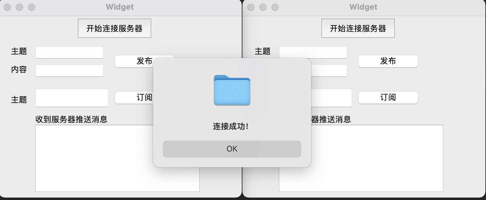

# **QT-MQTT**

A branch to show how to embed [qtmqtt](https://github.com/qt/qtmqtt) into a Qt project.


## **References**

- https://www.bilibili.com/video/BV1rF411j7qo/


## **Requirements**

Dependencies:

- Qt 6
- Vcpkg
    - qtmqtt

Server:

- [eclipse/mosquitto](https://github.com/eclipse/mosquitto)


## **How to use**

First, import and build the project.

<br/>

Start MQTT Broker:

>   https://github.com/JasonkayZK/docker-repo/blob/master/eclipse-mosquitto.sh

```shell
docker run -itd --restart=always -p 1883:1883 -p 9001:9001 --name my-eclipse-mosquitto eclipse-mosquitto

###### In Container ######
## Create user & passwd
## https://mosquitto.org/documentation/authentication-methods/
docker exec -it my-eclipse-mosquitto /bin/sh
cd /mosquitto
mosquitto_passwd -c password_file <username>
## Input passwd ...

## Change config
vi /mosquitto/config/mosquitto.conf
### listener 1883
### password_file /mosquitto/password_file

# Restart containner
docker restart my-eclipse-mosquitto
```

<br/>

Start two application, and push `开始连接服务器`：



一端设置监听 Topic：


另一端在对应主题发送内容：


